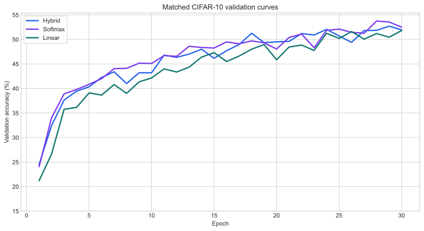
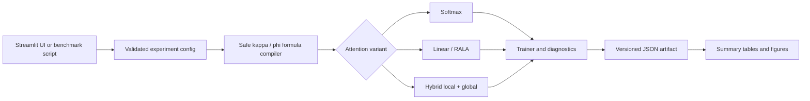

# RALA Formula Lab

[](https://github.com/0xSuleman/rala-formula-lab/actions/workflows/ci.yml)
[](https://www.python.org/)
[](LICENSE)

A reproducible PyTorch workbench for studying rank-augmented linear attention,
hybrid local/global attention, safe kernel formulas, and rank diagnostics on
controlled vision and associative-recall tasks.

This is an independent research prototype inspired by *Breaking the Low-Rank
Dilemma of Linear Attention*. It is not the authors' official implementation
and does not claim to reproduce the paper's ImageNet results.



## Research question

Can rank-aware global memory and output modulation preserve useful feature
diversity without giving up the efficiency advantages of linear attention?

The lab makes that question inspectable through:

- RALA, vanilla linear attention, Softmax, and a hybrid local/global variant.
- An AST-validated formula language for `kappa(x)` and `phi(x)`.
- Per-layer memory, global-output, and final-output rank diagnostics.
- CIFAR-10 and synthetic associative-recall experiments.
- JSON-first experiment records and deterministic report generation.
- A Streamlit interface for configuring, running, and exporting experiments.

## Verified results

The strongest controlled artifact compares three variants with the same seed,
model size, sample count, patch size, and 30-epoch budget.

| Variant | Best validation | Best epoch | Final validation | Recorded inference |
|---|---:|---:|---:|---:|
| Hybrid | 52.70% | 29 | 51.95% | 1333.04 ms |
| Softmax | **53.75%** | 28 | 52.50% | 636.46 ms |
| Linear | 51.80% | 30 | 51.80% | 661.72 ms |

Configuration: CIFAR-10, seed 7, D=64, four heads, two layers, 10,000
training samples, patch size 4, learning rate 1e-3.

The hybrid run is 1.05 percentage points below the best Softmax checkpoint and
0.90 points above linear attention. These are single-seed observations—not a
superiority claim. The recorded timings are provenance only because the
current artifacts do not establish a controlled hardware benchmark.

Newer experiments add two important findings:

- Large D=512 CIFAR-10 configurations reached 46.09% best validation accuracy;
  they changed several variables and are not a clean ablation.
- The latest associative-recall run ended at 72.68% train versus 14.70%
  validation accuracy. That failure is retained as evidence of memorization
  without useful held-out generalization.

See [the generated result report](results/LATEST_RESULTS.md),
[machine-readable summary](results/summary.csv), and
[artifact guide](results/README.md) for every committed run.

## System flow



The implemented RALA path follows the paper's rank-augmentation idea:

```text
Q_g = mean(Q)
alpha_j = N * softmax(Q_g kappa(K_j)^T)
B = sum_j alpha_j kappa(K_j)^T V_j
Y_i = phi(X_i) * (kappa(Q_i) B / normalizer)
```

The denominator includes epsilon protection. Formula input is parsed with
Python's AST and permits only the documented tensor operations; imports,
attributes, indexing, lambdas, comprehensions, and unknown functions are
rejected.

## Repository structure

```text
rala-formula-lab/
├── app.py                     # Streamlit research interface
├── rala_lab/                  # Attention, models, data, metrics, training
├── tests/                     # Formula-safety and attention diagnostics
├── scripts/
│   ├── build_results.py       # Validate JSON and rebuild tables/graphs
│   ├── run_benchmark.py       # Programmatic benchmark entry point
│   ├── stress_test.py         # Structural forward/backward smoke test
│   └── generate_runbook.py    # Rebuild the DOCX experiment runbook
├── results/
│   ├── runs/                  # 19 immutable experiment JSON files
│   ├── figures/               # Generated PNG and SVG figures
│   ├── LATEST_RESULTS.md      # Generated evidence summary
│   └── summary.csv            # Flattened machine-readable metrics
└── docs/                      # Report, runbook, formulation, presentation
```

## Quick start

```bash
git clone https://github.com/0xSuleman/rala-formula-lab.git
cd rala-formula-lab
python -m venv .venv
```

Activate the environment and install the project:

```bash
# Linux/macOS
source .venv/bin/activate

# Windows PowerShell
.venv\Scripts\Activate.ps1

python -m pip install --upgrade pip
python -m pip install -e ".[dev]"
```

Run the dashboard:

```bash
streamlit run app.py
```

Run the verification suite and rebuild result artifacts:

```bash
pytest
python scripts/build_results.py --check
python scripts/build_results.py
```

Dataset downloads are cached in `data/`. New UI runs are written to the
ignored `results/generated/` directory so an experiment is reviewed before it
becomes a committed artifact.

## Reproducibility contract

Each exported JSON records configuration, seed, epoch history, per-layer rank
statistics, final diagnostics, warnings, and recorded inference time. The
portfolio tables and graphs are generated from those JSON files rather than
manually copied values.

Before making a comparative claim:

1. keep dataset split, seed set, parameter budget, batch size, and training
   budget matched;
2. run multiple seeds and report mean, spread, and individual outcomes;
3. separate accuracy studies from controlled latency/memory benchmarks;
4. retain failed and negative runs; and
5. distinguish rank correlation from causal improvements.

## Artifacts

| Artifact | Purpose |
|---|---|
| [Research report](docs/rala-formula-lab-report.pdf) | Original project report |
| [Experiment runbook](docs/experiment-runbook.docx) | Planned ablations and run protocol |
| [Model formulation](docs/model-formulation.html) | Interactive architecture explanation |
| [Presentation](docs/presentation.html) | Browser-based project walkthrough |
| [Experiment worksheet](docs/experiment-worksheet.html) | Editable research notebook template |
| [Capacity analysis](results/CAPACITY_ANALYSIS.md) | Structural scale smoke test and its limits |
| [Reference material](docs/references/README.md) | Upstream papers and citations |

## Limitations and next experiment

- The committed result set uses seed 7; there are no confidence intervals.
- Several exploratory runs changed data, architecture, and optimization
  together, so they cannot isolate causal effects.
- CIFAR-10 subset results are research diagnostics, not state-of-the-art claims.
- Associative recall currently exposes a generalization failure.
- Existing timing values are not a hardware-controlled benchmark.

The next decisive milestone is a parameter-matched, five-seed ablation of
alpha weighting, the output gate, the salience gate, and global memory against
Softmax and vanilla linear attention.

## References and attribution

- Qihang Fan, Huaibo Huang, and Ran He,
  [*Breaking the Low-Rank Dilemma of Linear Attention*](https://openaccess.thecvf.com/content/CVPR2025/html/Fan_Breaking_the_Low-Rank_Dilemma_of_Linear_Attention_CVPR_2025_paper.html),
  CVPR 2025.
- RG-LRU/local-attention hybrid design is informed by
  [*Griffin: Mixing Gated Linear Recurrences with Local Attention for Efficient Language Models*](https://arxiv.org/abs/2402.19427).

The cited authors own their respective work. This repository contains an
independent educational implementation and experimental tooling by Suleman
Ahmed. See [CITATION.cff](CITATION.cff) for software citation metadata.

## License

Code in this repository is available under the [MIT License](LICENSE). External
papers in `docs/references/` remain under their publishers' and authors' terms.
