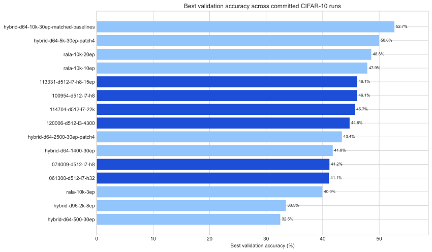
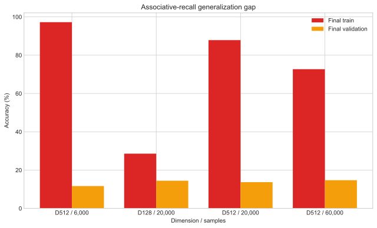

# Result artifacts

This directory is the evidence layer for RALA Formula Lab. Committed JSON files
are treated as immutable raw experiment records. Tables and figures are rebuilt
from them with:

```bash
python scripts/build_results.py
```

Use `python scripts/build_results.py --check` to validate schemas without
rewriting generated outputs.

## Inventory

| Location | Files | Scope |
|---|---:|---|
| `runs/cifar10/` | 9 | Early RALA, hybrid scaling, and the matched three-variant comparison |
| `runs/cifar10-scaling/` | 6 | Newer D=512 exploratory CIFAR-10 configurations |
| `runs/associative-recall/` | 4 | Synthetic recall generalization experiments |
| `summary.csv` | 1 | Flattened metrics for all primary and nested baseline variants |
| `LATEST_RESULTS.md` | 1 | Generated portfolio-facing interpretation |
| `figures/` | 6 | Three figures in both PNG and SVG formats |

There are 19 source JSON files and 30 summarized variants because several
artifacts contain nested baseline runs.

## Figures

### Matched CIFAR-10 comparison


### Committed CIFAR-10 run overview



### Associative-recall generalization



## Reading the metrics

- Best validation accuracy selects the maximum recorded validation checkpoint;
  final validation is the last epoch.
- Generalization gap is final training accuracy minus final validation
  accuracy. A large positive gap is a warning sign, not a performance win.
- Memory/output rank ratios describe the recorded tensor diagnostics; they do
  not establish causality.
- Inference values preserve the original JSON measurement but are not compared
  across hardware, devices, or changed configurations.

See [LATEST_RESULTS.md](LATEST_RESULTS.md) for the current evidence summary.
